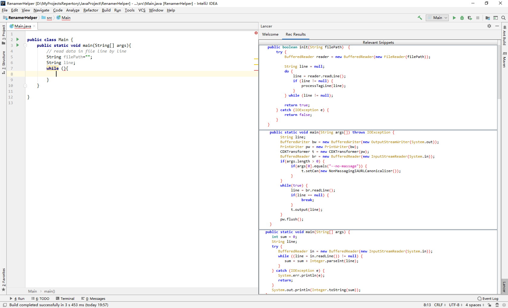

# Overview

We implement Lancer as an IntelliJ IDEA plugin. As shown in the following figure that Lancer can automatically analyze programmers' code context and recommend relevant code samples on the right side. 

Lancer has the automatic trigger mechanism (action.LAMPTypedHandler), and one can also manually invoke Lancer by  `ctrl + alt + A`. Each time a recommendation request is triggered, Lancer will send the current code context to the main server (**LancerMiner**) and display the recommended code samples on the GUI.

