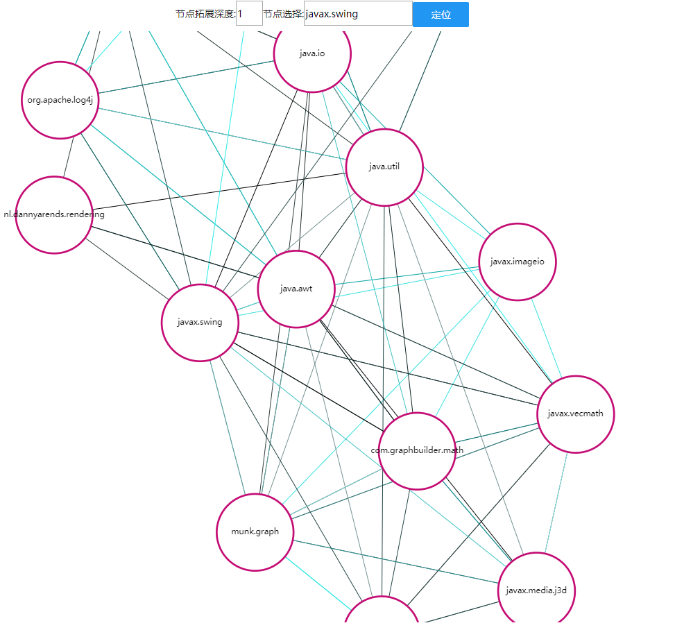

## Introduction

This project is built for visualizing the relations between libraries.

One can choose a library (e.g. the "javax.swing" shown in Figure 1) and select the relation degree (e.g. the "1" shown in Figure 1) to explore the relations.

Every node on the graph stands for one library. The edge between nodes represent the correlation between libraries.

### How to use

1. Using the service deployed on our server

   Visit [172.96.240.41:8080](http://172.96.240.41:8080) in **Chrome** and you can explore the relations between libraries by yourself.

2. Run the code on your own machines

   Download or clone this project and perform the following steps to establish a local server:

   > 1. install [node.js](https://nodejs.org/en/)
   >
   > 2. install http-server:
   >
   >    > npm install http-server -g
   >
   > 3. Locate to the root directory of the project (e.g. C:\Users\hasee\Desktop\LibLM Visualization  Server), then run
   >
   >    > http-server -p 8080  --cors=*
   >
   > 4. Visit 127.0.0.1:8080 in **Chrome** .

